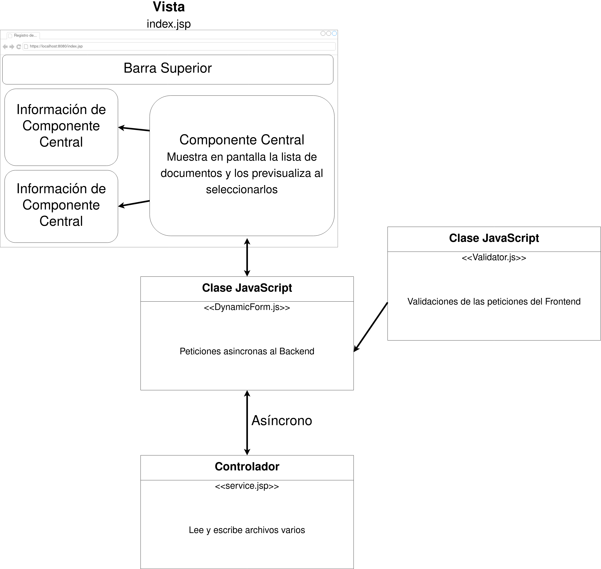

@author kenneth.pineda@unah.hn

@version 0.1.0

@date 2022/11/30

# Proyecto - Análisis y Diseño Orientado a Objetos

En este proyecto de Java Server Pages se realizará un Sistema de **Registros de Documentos** siguiendo las nomenclaturas y prácticas aprendidas en la asignatura **Programación Orientada a Objetos**.

# Problema

Se requiere un sistema de Registros de Documentos.

# Solución

- Se visualizará una página web que nos permita crear y acceder a documentos varios.

- En su componente principal se mostrará un registro de los documentos almacenados en el servidor

- en los componentes secundarios se mostrará información acerca de dicha lista.

- Se encontrará una barrra superior de herramientas con distintas opciones.

- Se harán validaciones con **JavaScript** en el frontend antes de enviar peticiones asíncronas al backend.

- En el backend se tendrá un controlador para leer y escribir archivos, haciendo uso de componentes **DAO** y **DTO** para la gestión de los mismos.

- El apartado visual se realizará con **Bootstrap** https://getbootstrap.com/docs/5.2/getting-started/introduction/ y se aplicará el uso de ventanas modales para las distintas funcionalidades que contenga el proyecto.

Se requerirán los siguientes componentes:

- **Archivos JSP**

    * **index.jsp**, Archivo que corresponde a la vista principal del proyecto.

    * **Service.jsp**, Archivo que corresponde al controlador del proyecto.

- **Archivos JS**

    * **DynamicForm.js**, Archivo que se encargará de realizar las peticiones asíncronas al Backend.

    * **Validator.js**, Archivo que se encargará de validar las peticiones para no enviar datos incorrectos o innecesarios al Backend.

- **Clases de Java**

    * **DocumentManager**, clase para gestionar el sistema de registro de documentos.

    * **FileManager**, clase que corresponde al modelo del proyecto. Gestor de archivos que lee y escribe archivos en el almacenamiento del backend.

    * **FileManagerResponse**, clase con los atributos que representan la respuesta generada por los métodos de la clase FileManager.

    * **DTO**, clase abstracta, se utilizará para transportar información compleja entre sesiones. Esta clase será heredada por otras subclases especializadas para cada tipo de objeto o archivo a manejar en el proyecto.

    * **DAO** clase abstracta, se utilizará para acceder a los datos por medio del uso de los métodos de FileManager. Esta clase será heredada por otras subclases especializadas para cada tipo de objeto o archivo a manejar en el proyecto.

    * **DAOResponse** clase abstracta con los atributos que representan la respuesta generada por la clase DAO. Esta clase será heredada por otras subclases especializadas para cada tipo de objeto o archivo a manejar en el proyecto.

Esta es la idea principal, el proyecto final puede o no puede contener los mismos archivos detallados en este documento.

